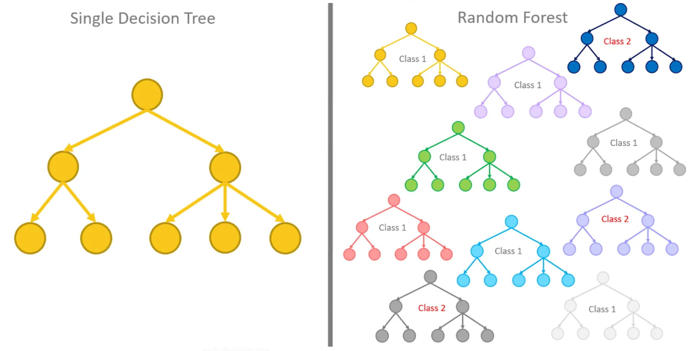
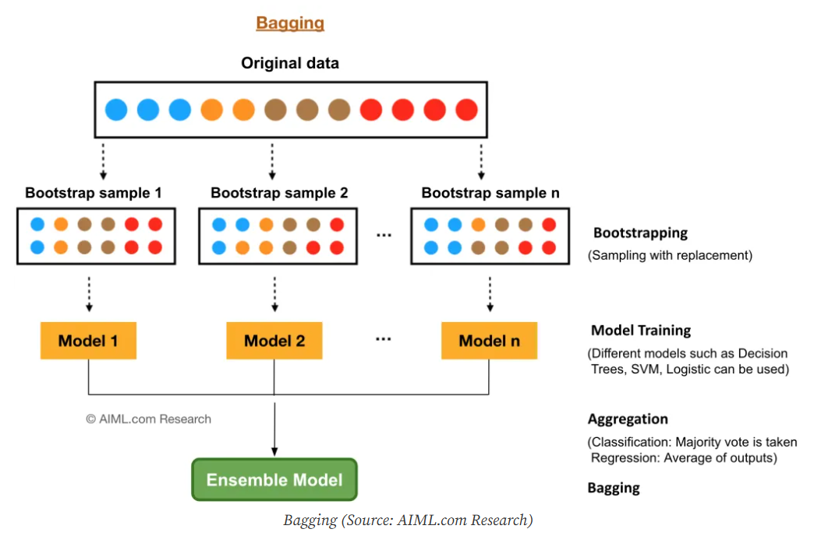

## **Quick Intro and Background**

Machine learning has been one of my favorite topics over the last few years, as I've been using approaches such as predictive models and cluster analysis. However, these are just a subset of the machine learning potential. With that in mind, I decided to take a step forward and learn what I believe to be the next topic in my field of expertise: Supervised Image Classification. This is a highly effective method for automatically identifying features in an image, such as forest patches, crops, urban areas, water bodies, and so on. In a few words, the way it works is by telling an algorithm how each of these features looks, based on reflectance signatures, and then it searches in the images for patterns on pixel aggregation that resemble the patterns of the input features.    

I've been trying to perform supervised image classification of satellite images in R for a while, and I've always stumbled upon conceptual problems, such as: How to do it? Which parameters to use for validation? Which packages and functions? What is happing on the background?

Even though this has been a very popular technique across remote sensing people and is widely available to learn on the internet, it's definitely easier to find tutorials for Python or software such as ArcGIS and QGIS than it's for R. I'm not saying there aren't tutorials in R out there, in fact, the content available here is from those tutorials, but I found this information very spread across a few blogs and a bit scarce.
So, after struggling to find a tutorial that I liked, I decided to create my own tutorial, based on what I could find online, while also adding my personal touch. 

This is my attempt to learn how to perform supervised image classification using the random forest algorithm. I'm pretty sure there are many other ways to carry it out, and definitely more efficient ones, but this is what I could get so far, and I believe that will suit a large audience. 

For the record, what I'm presenting here is a compilation of what is available in following blogs and tutorials:

- [WUR Geoscripting](https://geoscripting-wur.github.io/AdvancedRasterAnalysis/)

- [Cornell University](https://www.css.cornell.edu/faculty/dgr2/_static/files/R_html/CompareRandomForestPackages.html)

- [University of Cincinnati](https://uc-r.github.io/random_forests)

- [RPubs](https://rpubs.com/ials2un/rf_landcover)

- [RPubs](https://www.rpubs.com/BenKwesie/792661)

- [R-bloggers](https://www.r-bloggers.com/2021/04/random-forest-in-r/)

- [R Spatial](https://rspatial.org/rs/5-supclassification.html)

- [Valentin Stefan](https://valentinitnelav.github.io/satellite-image-classification-r/)

- [Urban Spatial](https://urbanspatial.github.io/classifying_satellite_imagery_in_R/)


## **About Random Forest**


**Random Forest** is a supervised nonlinear algorithm approach that allows for classifying a dataset into categories or classes using classification or regression techniques. It is a technique based on the approach of **Decision Trees**, with a difference in that Random Forest uses a collection of Decision Trees instead of a single one, therefore providing more flexibility, accuracy, and ease of access in the output. Decision trees have a limitation because they lack accuracy and show low accuracy during the testing phase due to the process called *over-fitting* (that here can be understood as a model that matches the training set so closely that it fails to make correct predictions on new data). Random Forest, on the other hand, forests help to reduce tree correlation by injecting more randomness into the tree-growing process. It searches for the best feature from a random subset of features, providing more randomness to the model and resulting in a better and accurate model. Being able to randomize the data and come up with random samples is important in building a model because it creates variation, minimizes bias, creates equivalent treatment groups, and, therefore, increases the model’s potential for generalizations.

Random Forest and Decision Trees both have a tree-like structure made up of nodes and branches. At each node, the data gets split based on one of the input features, creating two or more branches. This splitting continues at the next nodes, leading to even more branches that help break down the original data into smaller parts. The process goes on until you reach a point where most of the data in a node belongs to the same class, making further splits unnecessary.
The very first split happens at the root node, while the final nodes, called leaves, are linked to specific class labels. The routes you take from the root to each leaf outline the rules for classifying the data. [Check this out for a deep explanation](https://medium.com/data-science/from-a-single-decision-tree-to-a-random-forest-b9523be65147).

 [Source](https://medium.com/data-science/from-a-single-decision-tree-to-a-random-forest-b9523be65147)

Random Forest uses the **bagging** method in decision trees and, as a result, increases the accuracy of the learning model. Bagging trees introduces a random component into the tree-building process by building many trees on bootstrapped copies of the training data. Bagging then aggregates the predictions across all the trees; this aggregation reduces the variance of the overall procedure and results in improved predictive performance. 

Simply put, bagging (short for bootstrap aggregating) is directly derived from **bootstrapping**. It uses the concept of bootstrapping—sampling with replacement—to generate multiple datasets from the original training set. Bagging extends bootstrapping by applying it in the context of model training and prediction aggregation, turning a statistical resampling method into a powerful ensemble learning technique. Bootstrapping and bagging share a common foundation in that both involve sampling with replacement from the original training data to create new datasets. 

 [Source](https://bradleyboehmke.github.io/HOML/)

**Bootstrapping** is primarily a resampling technique used to estimate variability or confidence in statistical measures by generating multiple bootstrap samples. **Bagging** builds on this concept by using each of these bootstrap samples to train separate models, often referred to as base learners. While bootstrapping focuses solely on data generation, bagging takes it further by combining the predictions from these multiple models to form a more stable and accurate overall prediction. The main goal of bagging is to reduce variance and minimize overfitting in regression and classification tasks, making it a key ensemble method in machine learning, whereas bootstrapping itself is not directly concerned with model performance.

 [Source](https://aiml.com/what-is-bagging/)

**For more information**:

- [Random Forest Approach for Classification in R Programming](https://www.geeksforgeeks.org/random-forest-approach-for-classification-in-r-programming/)

- [Hands-On Machine Learning with R](https://bradleyboehmke.github.io/HOML/) 

- [From a Single Decision Tree to a Random Forest](https://medium.com/data-science/from-a-single-decision-tree-to-a-random-forest-b9523be65147) 

- [The Three Bs: Bootstrapping, Bagging, & Boosting!](https://medium.com/@curryrowan/the-three-bs-bootstrapping-bagging-boosting-43df4b372a6a)

- [What is Bagging? How do you perform bagging and what are its advantages?](https://aiml.com/what-is-bagging/)


## **That said, lets get started!!!**

In a few words, my goal here is to use a drone optical imagery I took during my fieldwork in Brazil and make a **model able to identify what is Bare Soil, Grass, and Trees** on it. This image was taken in *Chapada Dos Veadeiros National Park*, Brazil.

I broke down the workflow of this tutorial into six main steps, along with some intermediate ones. This step-by-step approach really helped me grasp how the classification process works.

## [1. Installing and Loading the Packages](#section1)

## [2. Loading, Checking, and Cleaning the Data](#section2)
### [2.1.](#section2-1) Loading the Datasets
### [2.2.](#section2-2) Checking up the Coordinate Reference System
### [2.3.](#section2-3) Checking up the Data Information and Structure
### [2.4.](#section2-4) Cropping the Raster Image
### [2.5.](#section2-5) Renaming and Selecting the Bands
### [2.6.](#section2-6) Visualizing the Raster and Polygons

## [3. Creating, Preparing, and Visualizing the Vegetation Indexes](#section3)
### [3.1.](#section3-1) Creating Vegetation Indexes
### [3.2.](#section3-2) Renaming, Visualizing, and Checking Vegetation Index Values
### [3.3.](#section3-3) Scaling Band Values and Remaking Vegetation Indexes
### [3.4.](#section3-4) Renaming, Visualizing, and Checking Vegetation Index Values
### [3.5.](#section3-5) Extracting the Pixel Values of Mapped Features and Assigning Vegetation Classes
### [3.6.](#section3-6) Visualizing the Vegetation Classes Distribution and Trends

## [4. Building and Training the Model](#section4)
### [4.1.](#section4-1) Partitioning the Data Into Training and Testing
### [4.2.](#section4-2) Assessing the Proportion of Split Data
### [4.3.](#section4-3) Building the Training Model
### [4.4.](#section4-4) Assessing Model Performance
### [4.5.](#section4-5) Applying the Model to the Test Dataset
### [4.6.](#section4-6) Performing Image Classification
### [4.7.](#section4-7) Visualizing the classification


If you want to follow and try each step described here by yourself please download the data. [HERE](https://github.com/souzayuri/souzayuri.github.io/tree/main/_posts/2025-01-05-random_forest_sup_classific_r).
If you want to 


### **Hands to Work**

To get started, the very first step is to load the necessary packages (assuming you already have R installed on your machine). We'll utilize **raster** and **terra** for handling raster data, **sf** for managing spatial data like points and polygons, and **tidyverse** for data tabulation and visualization. Additionally, we'll rely on **caret** for implementing random forest methods, and use **mapview** along with **leaflet** to plot and visualize both the polygons and raster images. While these are the primary packages we'll need, I'll also incorporate some others to further explore the results of our image classification.

## 1. Installing and Loading the Packages{#section1}

Begin by installing and loading the necessary packages, along with the additional ones you'll need. I prefer a setup this syntax that first checks if a package is already installed; if it isn't, it installs the package and then loads it afterward.

```{r packages, size = "tiny", include=TRUE}

if (!require("tidyverse")) install.packages("tidyverse")
if (!require("terra")) install.packages("terra")
if (!require("raster")) install.packages("raster")
if (!require("sf")) install.packages("sf")
if (!require("sp")) install.packages("sp")
if (!require("caret")) install.packages("caret")
if (!require("mapview")) install.packages("mapview")
if (!require("leaflet")) install.packages("leaflet")
if (!require("ggridges")) install.packages("ggridges")
if (!require("randomForest")) install.packages("randomForest")
if (!require("DiagrammeR")) install.packages("DiagrammeR")
if (!require("tmap")) install.packages("tmap")
if (!require("leafem")) install.packages("leafem")
if (!require("plotly")) install.packages("plotly")


```

## 2. Loading, Checking, and Cleaning the Data{#section2}

### **2.1 Loading the datasets**{#section2-1}

Let's load all the files and information we'll need later on:

- **woody_savanna.tif**: this is a drone image that I took during my master's. It has 6 stacked bands: Blue, Green, Red, Red Edge, Near Infrared, and a Mask in this respective order. The mask band represents pixels that could not be identified during the image compilation (to make this image, I needed to use Agisoft Metashape).

- **sampled_area.shp**: this is a polygon shapefile that we'll use to clip the image and restrict it to a area of 100m x 100m (therefore removing the edges of the image).

- **train_features.shp**: this file contains the features we'll use to train our Random Forest model. It contains three classes: Bare Soil, Grass, and Trees.

In this step we load the files and make sure to rename their classes using a standard nomenclature.

```{r loading and reading the files, size = "small", include=TRUE}

raw_raster <- terra::rast("woody_savanna.tif") |> 
  terra::aggregate(fact=2) # original pixel size = 10.8cm, new pixel size 21.6cm (old * 2)
raw_raster

plot(raw_raster)

sampled_area <- terra::vect("sampled_area.shp")
sampled_area
plot(sampled_area)


train_features <- sf::st_read("train_features.shp")
train_features

# renaming their classes accordingly to keep it consistent across upcoming analyses.
train_features_clnd <- sf::st_read("train_features.shp") |> 
  dplyr::rename(OBJECTID = "Classcode",
                Class = "Classname") |> 
  dplyr::mutate(OBJECTID = as.character(1:46),
                Class = as.factor(Class),
                Code = as.numeric(Class)) |> 
  dplyr::select(c(1:3))

train_features_clnd
plot(train_features_clnd)
```

### **2.2. Checking up the Coordinate Reference System**{#section2-2}

We also check their CRS (coordinate reference system) and ensure they'll have the same coordinate properties.

```{r checking up the CRS, size = "small", include=TRUE}

# Compare CRS, if they are different make them equal
if (terra::crs(raw_raster) == terra::crs(train_features_clnd)) {
  print("CRS are identical!")
} else {
  print("CRS are different. Therefore, reprojecting to match raster projection...")
  # Reproject train_features to match raw_raster
  train_features_clnd <- sf::st_transform(train_features_clnd, crs = terra::crs(raw_raster))
}


# Compare CRS again to ensure they above function worked.
if (terra::crs(raw_raster) == terra::crs(train_features_clnd)) {
  print("CRS are identical!")
} else {
  print("CRS are different. Therefore, reprojecting to match raster projection...")
  # Reproject train_features to match raw_raster
  train_features_clnd <- sf::st_transform(train_features_clnd, crs = terra::crs(raw_raster))
}


```

### **2.3. Checking up the data information and structure**{#section2-3}

Let's check the training data and the number of features, which has a total of 46. 
Here we can see that every training class has 15 features/polygons. Grass has 16 because I added one more by mistake, and I was too lazy to remove it =).

```{r checking up the data, size = "small", include=TRUE}
glimpse(train_features_clnd)
summary(train_features_clnd)

```

### **2.4. Cropping the raster image**{#section2-4}

Now that we've standardized the data, we'll crop the raster image to the 100m x 100m grid limit. 
We also want to check the CRS and make sure it's correct, and plot each of these bands side-by-side.
 
```{r cropping the raster image, size = "small", include=TRUE}

cropped_raster <- terra::crop(raw_raster, sampled_area)
cropped_raster
plot(cropped_raster)


# Compare CRS
if (terra::crs(raw_raster) == terra::crs(train_features_clnd)) {
  print("CRS are identical!")
} else {
  print("CRS are different. Therefore, reprojecting to match raster projection...")
  # Reproject train_features to match raw_raster
  train_features_clnd <- terra::project(train_features_clnd, crs(raw_raster))
}


```

### **2.5. Renaming and Selecting the Bands**{#section2-5}

So far, we have ensured the consistency of the image coordinates and defined the grid area we want to work on.
Now, let's rename the bands according to their respective spectral signatures. This will help us later identify which band is which.
In this step, I also removed the band MASK by only selecting the bands of interest according to their position in the bands list (1 to 5).

```{r defining band names, size = "small", include=TRUE}

names(cropped_raster) <- c("Blue","Green","Red","RE","NIR","MASK")
plot(cropped_raster)

cropped_raster_bands <- cropped_raster[[1:5]]
plot(cropped_raster_bands)

```

### **2.6. Visualizing the Raster and Polygons**{#section2-6}

Now that we've the raster with five bands and the polygons ready for training the model, let's visualize our data. We'll create a natural color composition. To do this we need to inform the position of the RGB bands of the raster image (that is why naming it before hand was important) and overlay it with each class represented by the polygons. For visualization, we'll use *mapview()* because it's interactive (just because we want some cool!!!).

```{r visualizing the raster and the polygons, echo = TRUE, include=TRUE}

train_class_colors <- unique(train_features_clnd$Class) |> 
  as.data.frame() |>
  dplyr::mutate(hex = c(grass = "#ff7f00",
                        bare_soil = "#e41a1c",
                        tree = "#55eed1"))
train_class_colors

mapview::viewRGB(brick(cropped_raster_bands[[1:3]]), 
                 r = 3, g = 2, b = 1,
                 map.types = c("Esri.WorldImagery", "OpenStreetMap", "OpenTopoMap"),
                 maxpixels =  866760,
                 layer.name = "RBG Image") + 
  mapview::mapView(train_features_clnd, 
                   zcol = "Class", 
                   color = "black",  
                   lwd = 2,
                   col.regions = train_class_colors$hex,
                   layer.name = "Features")


```

## 3. Creating, Preparing, and Visualizing the Vegetation Indexes{#section3}

One nice aspect of using optical imagery rasters with various bands is the ability to rearrange these bands to create new and informative images. To provide some context, the drone imagery we're working with includes natural color RGB bands, which are part of the visible spectrum for humans, along with the Red Edge and Near-Infrared bands, which lie outside this spectrum. The latter two bands are particularly useful for highlighting vegetation characteristics, as plants reflect a significant amount of infrared light. This unique property makes infrared imagery an invaluable tool for analyzing vegetation, as it offers deeper insights into the state, health, vigor, and other attributes of plants that natural color imagery simply cannot reveal.

Now that we have our raster image and training features prepared, let's move on to the next step: using this raster image and bands to create various vegetation indexes. They will be stacked as bands and will be used to train the model, using the mapped polygons, and to predict the vegetation classes in the later steps of the classification. This process will improve the classification of the image by pinpointing pixel combinations that are more accurately representative of the specific vegetation characteristics we aim to map.

### **3.1. Creating Vegetation Indexes**{#section3-1}

When conducting image classification, it’s crucial to provide clear information that highlights the distinguishing features you’re mapping. In this section, we'll focus on creating three widely used vegetation indexes in remote sensing: the NDVI (Normalized Difference Vegetation Index), the EVI (Enhanced Vegetation Index), and the SAVI (Soil Adjusted Vegetation Index). Each of these indexes interprets vegetation in unique ways, and allow to use them alongside the spectral bands from the drone imagery, therefore making the classification more robust.

This is a straightforward process that primarily involves utilizing the Red, Near Infrared, and Blue bands, along with a few predefined parameters. Each index has its own arithmetic equation, and we can identify these bands based on their positions within the raster. We will then plot these indexes side-by-side.

Check out below a table summarizing the similarity and differences among these indexes.

| Feature           | **NDVI** (Normalized Difference Vegetation Index)       | **EVI** (Enhanced Vegetation Index)                                 | **SAVI** (Soil Adjusted Vegetation Index)                           |
|-------------------|---------------------------------------------------------|----------------------------------------------------------------------|----------------------------------------------------------------------|
| **Formula**        | (NIR - Red) / (NIR + Red)                                | 2.5 × (NIR - Red) / (NIR + 6 × Red - 7.5 × Blue + 1)                   | ((NIR - Red) / (NIR + Red + 0.5)) × (1 + 0.5)                            |
| **Bands Used**     | NIR, Red                                                | NIR, Red, Blue                                                       | NIR, Red                                                             |
| **Purpose**        | General greenness/vegetation presence                   | Improves sensitivity in high biomass areas                           | Adjusts for soil background noise                                   |
| **Advantages**     | Simple, widely used                                     | Corrects for atmospheric & canopy background effects                 | Better for areas with sparse vegetation or exposed soil             |
| **Limitations**    | Sensitive to soil brightness and atmospheric conditions | More complex, needs Blue band                                        | Requires adjustment factor (L) based on soil type                   |                         |
| **Value Range**    | -1 to +1 (usually 0 to 0.8 in vegetated areas)          | -1 to +1 (typically 0 to 0.9 for vegetation)                         | -1 to +1 (usually 0 to 0.7, depending on L and vegetation density)  |

```{r creating vegetation indexes, echo = TRUE, include=TRUE}

nir <- cropped_raster_bands[[5]]
red <- cropped_raster_bands[[3]]
blue <- cropped_raster_bands[[1]]

# Check the range of your input bands
print(paste("NIR range:", minmax(nir)))
print(paste("Red range:", minmax(red)))
print(paste("Blue range:", minmax(blue)))

cropped_raster_bands_ndvi <- (nir - red) / (nir + red)
cropped_raster_bands_ndvi

cropped_raster_bands_evi <- 2.5 * ((nir - red) / (nir + (6 * red) - (7.5 * blue) + 1))
cropped_raster_bands_evi

cropped_raster_bands_savi <- ((nir - red) / (nir + red + 0.5)) * (1 + 0.5)
cropped_raster_bands_savi

# Create a red-to-green color palette
red_to_green_palette <- colorRampPalette(c("darkred", "yellow", "darkgreen"))
# Lets visuallize them together
par(mfrow = c(1, 3))

plot(cropped_raster_bands_ndvi, main = "NDVI", col = red_to_green_palette(100))
plot(cropped_raster_bands_evi, main = "EVI", col = red_to_green_palette(100))
plot(cropped_raster_bands_savi, main = "SAVI", col = red_to_green_palette(100))

par(mfrow = c(1, 1))


```

### **3.2. Renaming, Visualizing, and Checking Vegetation Index Values**{#section3-2}

Let's stack these three indexes in our raster data so we can have more information to feed the model. After stacking the rasters containing the indexes with our main raster, we'll notice that the new rasters are named as NIR. That is because the first spectral band we used in the above calculations was the NIR band. To avoid confusion between the NIR spectral band and the new rasters indexes, we'll name them according to which index they represent.

```{r stacking indexes and bands, echo = TRUE, include=TRUE}

train_features_clnd_indexes <- c(cropped_raster_bands, 
                                 cropped_raster_bands_ndvi,
                                 cropped_raster_bands_evi, 
                                 cropped_raster_bands_savi)
train_features_clnd_indexes


names(train_features_clnd_indexes) <- c(names(cropped_raster_bands),"NDVI", "EVI", "SAVI")
train_features_clnd_indexes

plot(train_features_clnd_indexes)

summary(train_features_clnd_indexes)

```

### **3.3. Scaling Band Values and Remaking Vegetation Indexes**{#section3-3}

You probably have noticed that the index values of NDVI, EVI, and SAVI range beyond the expected range of -1 to 1. 
That is because we need to convert our raw band values to reflectance values normalized to 0-1 range. 
This conversion could have been done in previous steps, but I wanted to present you with this common issue.
To convert, we will simply divide each band by the theoretical maximum value of the drone image we got (in our case 65535, a 16-bit image).
Let's convert these numbers and redo what we've done in the step **3.1. Creating Vegetation Indexes**.

```{r scale down bands and recalculate indexes, echo = TRUE, include=TRUE}

cropped_raster_bands_scaled = cropped_raster_bands/ 65535


# splitting the required bands
nir <- cropped_raster_bands_scaled[[5]]
red <- cropped_raster_bands_scaled[[3]]
blue <- cropped_raster_bands_scaled[[1]]

# Check the range of your input bands
print(paste("NIR range:", minmax(nir)))
print(paste("Red range:", minmax(red)))
print(paste("Blue range:", minmax(blue)))

cropped_raster_bands_ndvi_scaled <- (nir - red) / (nir + red)
cropped_raster_bands_ndvi_scaled

cropped_raster_bands_evi_scaled <- 2.5 * ((nir - red) / (nir + (6 * red) - (7.5 * blue) + 1))
cropped_raster_bands_evi_scaled

cropped_raster_bands_savi_scaled <- ((nir - red) / (nir + red + 0.5)) * (1 + 0.5)
cropped_raster_bands_savi_scaled

# Create a red-to-green color palette
red_to_green_palette <- colorRampPalette(c("darkred", "yellow", "darkgreen"))
# Lets visuallize them together
par(mfrow = c(1, 3))

plot(cropped_raster_bands_ndvi_scaled, main = "NDVI", col = red_to_green_palette(100))
plot(cropped_raster_bands_evi_scaled, main = "EVI", col = red_to_green_palette(100))
plot(cropped_raster_bands_savi_scaled, main = "SAVI", col = red_to_green_palette(100))


```

### **3.4. Renaming, Visualizing, and Checking Vegetation Index Values**{#section3-4}

If you check the new values, you'll see that they range from -1 to 1, therefore properly scaled down.

```{r exploring the data, echo = TRUE, include=TRUE}

train_features_clnd_indexes_scaled <- c(cropped_raster_bands_scaled, 
                                        cropped_raster_bands_ndvi_scaled,
                                        cropped_raster_bands_evi_scaled, 
                                        cropped_raster_bands_savi_scaled)
train_features_clnd_indexes_scaled

# renaming the bands by using their position in the list
names(train_features_clnd_indexes_scaled) <- c(names(cropped_raster_bands_scaled),"NDVI", "EVI", "SAVI")
train_features_clnd_indexes_scaled

plot(train_features_clnd_indexes_scaled)

summary(train_features_clnd_indexes_scaled)

```

### **3.5. Extracting the Pixel Values of Mapped Features and Assigning Vegetation Classes**{#section3-5}

With these images, we've everything we need to move forward, preparing the data that will be used to train and test our random forest model. 
Let's start by extracting the pixel values for the features we mapped. We will later use these pixel values to train and test the model.

```{r extracting data to vegetation classes, echo = TRUE, include=TRUE}

# extracting the pixel information using the mapped features/polygons
train_features_clnd_pxls <- extract(train_features_clnd_indexes_scaled, train_features_clnd)
head(train_features_clnd_pxls)

# Let's use ID values to index into the Class vector. This indexing operation retrieves the class names/values that correspond to each ID value. These retrieved class names/values are then assigned to a new column called.
train_features_clnd_pxls$Class <- train_features_clnd$Class[train_features_clnd_pxls$ID]
head(train_features_clnd_pxls)

# now that we have the class names we don't need the ID index position
train_features_clnd_pxls$ID <- NULL

summary(train_features_clnd_pxls)

```

### **3.6. Visualizing the Vegetation Classes Distribution and Trends**{#section3-6}

Now that we've assigned each band and vegetation indexes to the mapped features, let's take a look at the distribution of each vegetation class using a histogram of frequency.

```{r visualizing the frequency of pixels for each vegetation class, echo = TRUE, include=TRUE}

val_grass <- subset(train_features_clnd_pxls, Class == "grass")
head(val_grass)
val_trees <- subset(train_features_clnd_pxls, Class == "trees")
head(val_trees)
val_bare_soil <- subset(train_features_clnd_pxls, Class == "bare_soil")
head(val_bare_soil)

# NDVI
par(mfrow = c(3, 1))
hist(val_grass$NDVI, main = "grass", xlab = "NDVI", xlim = c(0, 1), col = "#e5ca81")
hist(val_trees$NDVI, main = "trees", xlab = "NDVI", xlim = c(0, 1), col = "#81a581")
hist(val_bare_soil$NDVI, main = "bare_soil", xlab = "NDVI", xlim = c(0, 1), col = "#7b6f89")
```

We can also fit a linear model using the pixel values of different indexes to see how they correlate and visualize them using a scatter plot. 

```{r visualizing the relationship between vegetation indices for each vegetation class, echo = TRUE, include=TRUE}

# Scatterplot of NDVI and SAVI bands 
plot(NDVI ~ EVI, data = val_grass, pch = ".", col = "#e5ca81", xlab = "SAVI", ylab = "NDVI")
points(NDVI ~ EVI, data = val_trees, pch = ".", col = "#81a581")
points(NDVI ~ EVI, data = val_bare_soil, pch = ".", col = "#7b6f89")

# making a regression model to get the trending line for each vegetation class
model_grass <- lm(NDVI ~ EVI, data = val_grass) 
abline(model_grass, col = "#e5ca81", lwd = 2)    

model_trees <- lm(NDVI ~ EVI, data = val_trees) 
abline(model_trees, col = "#81a581", lwd = 2)   

model_bare_soil <- lm(NDVI ~ EVI, data = val_bare_soil) 
abline(model_bare_soil, col = "#7b6f89", lwd = 2)        

legend("topright", legend = c("grass", "trees", "bare_soil"), 
       fill = c("#e5ca81", "#7b6f89", "#81a581"), bg = "white")


```
Or use a histogram of frequency, along with facet_wrap(), to plot all vegetation classes and indexes together making them easily comparable.

```{r visualizing and comparing indexes values distribution across vegetation classes and indexes using histograms, echo = TRUE, include=TRUE}

# selecting only the indexes and classes
train_features_clnd_pxls_indexes <- train_features_clnd_pxls |> 
  dplyr::select(c(NDVI, EVI, SAVI, Class)) |> 
  tidyr::pivot_longer(cols = 1:3, values_to = "values", names_to = "indexes")
train_features_clnd_pxls_indexes


# add the distribution curve for each indexes parameter using stat_function and dnorm function
ggplot(train_features_clnd_pxls_indexes, 
                        aes(x = values, 
                            fill = indexes)) +
  geom_density_ridges(aes(y = 0, fill = indexes, color = indexes),  
                      jittered_points = TRUE, 
                      alpha = .5, 
                      scale = 1,
                      point_shape = "|",
                      point_size = 3, 
                      position = ggridges::position_points_jitter(width = 0.05, height = 0)) +  
    geom_vline(data = train_features_clnd_pxls_indexes |> 
               dplyr::group_by(Class, indexes) |> 
               dplyr::summarise(mean = mean(values), .groups = "drop") |> 
               dplyr::ungroup(),
             aes(xintercept = mean, color = indexes), linetype = "dashed", linewidth = 0.8) +
  scale_fill_manual(values = c("#e5ca81", "#7b6f89", "#81a581"), labels = c("EVI", "NDVI", "SAVI")) +
  scale_color_manual(values = c("#e5ca81", "#7b6f89", "#81a581"), labels = c("EVI", "NDVI", "SAVI")) +
  theme_bw() + labs(x = "", y = "Frequency") +
  theme(axis.title = element_text(size = 20, face = "bold", color = "gray20"),
        axis.text.x.bottom = element_text(size = 14),
        axis.text.y = element_text(size = 14),
        legend.direction = "horizontal",
        legend.position = "bottom",
        legend.title = element_text(size = 16, face = "bold"),
        legend.text = element_text(size = 14),
        title = element_text(size = 18)) +
  facet_wrap(~Class, ncol = 3, scales = "free")


```

## 4. Building and Training the Model {#section4}

With the difference image bands normalized, vegetation indexes calculated, and vegetation classes assigned to previous mapped features, we're now able to move forward in building the training and testing model. 

The training set is used to train the Random Forest model, while the testing set is used to evaluate its performance on data it hasn't seen before. This separation helps prevent overfitting — where the model memorizes the training data but fails to generalize to new data. In this case, 80% of the data is used to teach the model which vegetation classes correspond to specific band reflectance values and vegetation indexes. The remaining 20% is then used to test how accurately the trained model can predict vegetation classes for new "unseen" data. These proportions are just recommendations, but for small sample sizes it is suggested to use 90% for training.

### **4.1. Partitioning the Data Into Training and Testing**{#section4-1}

We'll use the caret function createDataPartition() to split the data into training and testing sets. Other functions with different parameters can also be used to split it, but for the purpose of this tutorial, let's keep it simple.

After partitioning, we'll use a portion of the dataset for training (80%) and testing (20%).
If we check the number of rows in the new datasets and use the "three-step rule" equation, we can confirm that the data was properly split.

```{r Partitioning the data, echo = TRUE, include=TRUE}

# set seed will ensure we get the values you get on your computer are the same as we got in this tutorial
set.seed(044) 

# checking the structure of our dataset
str(train_features_clnd_pxls)


# partitioning the data into 80% (p = 0.8, the percentage of data that goes to training).
rf_train_features_clnd_pxls_indexes <- caret::createDataPartition(train_features_clnd_pxls$Class, list = FALSE, p = 0.8)
str(rf_train_features_clnd_pxls_indexes)


# setting 80% for training - Use "rf_train_features_clnd_pxls_indexes" as a vector of row indices that specify which rows to extract from the train_features_clnd_pxls dataset.
rf_train_data <- train_features_clnd_pxls[rf_train_features_clnd_pxls_indexes, ] 
str(rf_train_data)

# setting 20% for testing - Use "-rf_train_features_clnd_pxls_indexes" as a vector of row indices that specify which rows to extract from the train_features_clnd_pxls dataset.
rf_test_data <- train_features_clnd_pxls[-rf_train_features_clnd_pxls_indexes, ]
str(rf_test_data)

```

### **4.2. Assessing the Proportion of Split Data**{#section4-2}

Let's check the proportion of data points/pixels and features selected for training and testing data, respectively.

Training:

```{r proportion of training features, echo = TRUE, include=TRUE}

rf_train_data_classCount <- rf_train_data |> 
  dplyr::group_by(Class) |> 
  count()

rf_train_data_classCount

(prop.table(table(rf_train_data$Class))*100)

```

Testing:

```{r proportion of testing features, echo = TRUE, include=TRUE}

rf_test_data_classCount <- rf_test_data |> 
  dplyr::group_by(Class) |> 
  count()

rf_test_data_classCount

(prop.table(table(rf_test_data$Class))*100)

```

### **4.3. Building the Training Model**{#section4-3}

To build our training model I'll break it down into three mains steps:

**1) Defining parameters for training**. The function **trainControl()** generates parameters that further control how models are created, letting you set up the rules for how your model will be trained and tested. In this part, we'll use Cross-Validation with 10 folds. It means that the training data will be divided into 10 equal parts, with the model trained on 9 parts and validated on the remaining part. This process repeats 10 times with a different validation fold each time, ensuring every observation gets used for both training and validation.

**2) Defining Response and Predictive Variables**. We'll define Class as the response variable and the reflectance bands, along with the vegetation indexes, as predictors. The reason is that we want to know how vegetation classes can be determined by their spectral signature. 

**3) Building and Running the Model**. Now we'll use the parameters and variables determined before to build the model. We're going to use the function **train()**, from the package caret, to build the training model using the Random Forest algorithm. 
We'll use *Kappa (Cohen's Kappa)* metric (as it allows to checks models performance, by comparing observed accuracy with expected accuracy by taking into account the possibility of agreement occurring by chance), a *1000 trees* (number of decision trees to grow in your Random Forest - more trees generally lead to a more robust model as the ensemble can better capture complex patterns in the data, but requires more computer processing), and set *8* for the different numbers of the hyperparameter *mtry*.

The hyperparameters are configuration settings that control the learning algorithm's behavior. Setting it to 8 means that we will test 8 different values for the key hyperparameter *mtry* (the number of variables randomly considered at each decision tree split - in this case, it'll be 8 because we've 8 predictors). Rather than manually selecting which values to try, the caret package creates a grid of 8 evenly spaced values across the appropriate range for this hyperparameter. Each of these 8 configurations undergoes the full cross-validation process, and the one producing the best performance (measured by the Kappa statistic) is selected for the final model.

It is worth mentioning the hyperparameter *mtry* to understand better how the Random Forest is handling our data on the background. The *mtry* is a key hyperparameter in Random Forest models that stands for "variables randomly sampled as candidates at each split". When a Random Forest builds each decision tree, at each node (decision point), the algorithm doesn't consider all available predictors. Instead, it randomly selects a subset of the available predictors to consider for that particular split. The size of this random subset is controlled by the *mtry* parameter. By testing all 8 possible values, we'll get a more thorough hyperparameter search that covers the entire possible range. This will find the optimal number of variables to consider at each split for your specific dataset. 

Note that we can use all 8 predictors because this is a low number of variables and we'll not be computational demanding, but you don't have to set tuneLength to the maximum number of your predictors.

```{r setting the RF parameters, echo = TRUE, include=TRUE}

# 1) Defining parameters for training
cvControl <- caret::trainControl(method = 'cv', # cross-validation
                                 number = 10, # number of folds
                                 savePredictions = TRUE, #save the predictions made during cross-validation (useful for later analysis)
                                 verboseIter = FALSE) #won't print progress details during training


# 2) Defining Response and Predictive Variables 
respVar <- c("Class") # response
predVar <- c("Blue","Green","Red","RE","NIR","NDVI","EVI","SAVI") # predictors


# 3) Building and Running the Model
rfModel <- caret::train(rf_train_data[,predVar], # predictors
                        rf_train_data[,respVar], # response
                        method = "rf", # Random Forest algorithm
                        metric = "Kappa",
                        ntree = 1000, # number of trees, 1000
                        trControl = cvControl, # rules for training and testing the training data
                        tuneLength = 8, # different numbers of hyperparameters   
                        importance = TRUE) # Calculates variable importance (which features matter most)

rfModel

```
### **4.4. Assessing Model Performance**{#section4-4}

Among the 8 defined predictors, the *mtry* 7 was selected as the best model due to the highest Kappa and Accuracy values across tuning parameters.
The accuracy measures proportion of correctly classified samples (higher is better), while Kappa measures the agreement between predicted classifications and actual classifications that takes into account the possibility of agreement occurring by chance (higher is better, 0.81-1.00 is Almost perfect agreement).
Even though the Kappa and Cross-Validation are distinct things, the model returns them as *Kappa (Cross-Validation)* because Kappa values are obtained through cross-validation. The Kappa values shown are averaged across the resampling results from our cross-validation folds.
 
In summary, what happens is that when training a Random Forest model using caret() we specified the 10 fold Cross-Validation as our resampling method. For each parameter combination (mtry values 2-8 predictors) and for each fold of the 10-fold Cross-Validation, the performance metric (Kappa) is computed over the 10 folds. When we call plot() on the train object, caret creates a visualization of these averaged Cross-Validation results, with the tuning parameter (mtry) on the X-axis and the performance metric (Kappa) on the Y-axis.

```{r plot model, echo = TRUE, include=TRUE}

rfModel

plot(rfModel)

```
Another way to visualize is by checking the error rates of each classified feature. 
The values from 0 to 0.25 represent the proportion of misclassified samples. 
The error rates usually decrease as more trees are added to the forest and stabilize somewhere below 0.10 (10%).
In the graph below, the color represents:

- Black line: *Overall Out-Of-Bag (OOB)* error rate - shows the average error across all classes
- Red line: Error rate for 1st class, "bare_soil" class - shows how well the model classifies bare soil samples
- Green line: Error rate for 2nd class, "grass" class - shows how well the model classifies grass samples
- Blue line: Error rate for 3rd class, "trees" class - shows how well the model classifies tree samples

As we can see, the model didn't perform so well classifying "bare_soil" as it did for other classes. 
We can kind of see the misclassified samples trends in the confusion matrix.
Trees had the lowest error rate, meaning the model structure was good for classifying this vegetation type.
Overall, the *OOB* had a low misclassified value, thus supporting the robustness of our model.

```{r var error, echo = TRUE, include=TRUE}

# first glimpse on the models classification performance
rfModel$finalModel

# checking the error values of each class
head(rfModel$finalModel$err.rate)

# visualizing the error values of each class
plot(rfModel$finalModel)


```

We should also check the importance of each reflectance band and vegetation indexes for identifying the vegetation cover.
For this purpose we'll visualize the variables ranked by the *MeanDecreaseAccuracy* and the *MeanDecreaseGini*.

*MeanDecreaseAccuracy* is a performance metric that measures the proportion of correct predictions across all trees in the random forest. When measuring variable importance, the model first establishes a baseline accuracy using *Out-Of-Bag (OOB)* samples. Then, values for a specific variable are randomly shuffled in these samples, and the model is re-evaluated. The difference between the baseline accuracy and this new accuracy is the decrease in accuracy attributable to that variable. A larger decrease in accuracy when a variable is shuffled indicates greater importance of that variable. Variables are presented in descending order of importance, with those at the top causing the greatest drop in accuracy when removed or shuffled.

The *MeanDecreaseGini* measures how each variable contributes to the node purity in the random forest. A higher value indicates that a particular predictor variable plays a greater role in partitioning the data into the defined classes. Higher values indicate greater importance of the variable to your model. This metric measures the total decrease in Gini impurity for a variable across all trees in the forest. Variables that lead to larger decreases in Gini impurity are considered more important, as they're more effective at creating homogeneous (pure) nodes.

In summary, *Accuracy* focuses on prediction performance, while *Gini* focuses on the creation of pure nodes during tree construction.

```{r var contribution, echo = TRUE, include=TRUE}

varImpPlot(rfModel$finalModel)

```
### **4.5. Applying the Model to the Test Dataset**{#section4-5}

We've split the data into 80% for training and 20% for testing, meaning that our model has not seen 20% of it yet. 
Let's use the model built to see how it performs in predicting those 20% left. 

In this step, we'll evaluate the model performance by checking the *Accuracy*, *Kappa*, *Confusion Matrix*, *Sensitivity*, and *Specificity*.
The first two we've seen before and focus more on the overall performance of the model, while the last three evaluate it by each of the classified features.

The *Confusion Matrix* summarizes which features were misclassified and taken for other features. Ex: 25 trees were identified as bare_soils and 30 as grasses.
The *Sensitivity* measures how well the model correctly identifies actual positives, in other words: "Of all actual class "tree" pixels, how many did the model correctly classify as class "trees"? The model correctly identified 97.85% of actual "trees" pixels. Now, complementary, *Specificity* measures how well the model correctly identifies actual negatives, in other words: "Of all non-class "grass" pixels, how many did the model correctly classify as not class "grass"? 95.87% of non-"grass" pixels were correctly classified as not "grass". 

Check out these two videos if you want to know more about these metrics:
- [Confusion Matrix Explained](https://www.youtube.com/watch?v=8A2hog3CgHI&ab_channel=yuzaRDataScience)
- [7 Must-Know Metrics That Power Machine Learning](https://www.youtube.com/watch?v=ZkAzmxrRhvQ&ab_channel=yuzaRDataScience)

```{r predicting the test data, echo = TRUE, include=TRUE}

rfPredict <- predict(rfModel, rf_test_data)
head(rfPredict)

conf_matrix <- confusionMatrix(rfPredict, rf_test_data$Class)
conf_matrix

conf_table <- as.data.frame(conf_matrix$table)

colnames(conf_table) <- c("Predicted", "Actual", "Frequency")
conf_table

ggplot(data = conf_table, aes(x = Actual, y = Predicted, fill = Frequency)) +
  geom_tile(color = "white") +
  scale_fill_gradient(low = "white", high = "darkgreen") +
  geom_text(aes(label = Frequency), color = "black", size = 5) +
  labs(title = "Confusion Matrix Heatmap",
       x = "Actual Labels",
       y = "Predicted Labels",
       fill = "Frequency") +
  theme_minimal(base_size = 14) +
  theme(axis.text.x = element_text(angle = 45, hjust = 1))


```
### **4.6. Performing Image Classification**{#section4-6}

Just recapping, so far we've been using pixel values extracted within the boundaries of our mapped features to:

**1)** Train the model using 80% of these pixel values.

**2)** Testing the model using the 20% left of these pixel values.

Now, we're gonna use the training model to predict the vegetation cover type for our full image (that one containing all reflectance bands and indexes). 
To do so, we'll use the function *predict()*. 

```{r classifying the full image, echo = TRUE, include=TRUE}

image_lc_predict <- terra::predict(train_features_clnd_indexes, rfModel) 
image_lc_predict

# checking how many pixels were assigned for each feature
pixel_counts <- raster::freq(image_lc_predict)
pixel_counts

```

### **4.7. Visualizing the classification**{#section4-7}

Let's plot the created image and determine feature colors for better visualization.

```{r plotting the classified image, echo = TRUE, include=TRUE}

#Lets define the plalette(mainly be using Hexadecimal colours).
pal <-c("#7b6f89", "#81a581", "#e5ca81")

tmap::tm_shape(image_lc_predict)+
  tmap::tm_raster(style = "cat",
                  labels = c("bare_soil",
                             "trees", 
                             "grass"),
                  palette = pal,
                  title = "Legend") +
  tmap::tm_layout(main.title= "",
                  main.title.size =.9 ) +
  tmap::tm_layout(legend.outside = TRUE,
                  legend.outside.position = "right",
                  legend.title.size = .8)


```

We can also visualize it using an interactive plot, through *leaflet()* function, and overlay it with a basemap.
It looks like our model had a fair performance at predicting the vegetation types and cover.

```{r visualizing the map interactively, echo = TRUE, include=TRUE}

raster_lc_predict <- raster::raster(image_lc_predict)

pal <- leaflet::colorFactor(
  palette = c("#7b6f89", "#81a581", "#e5ca81"), 
  levels = c(1, 2, 3) 
)

leaflet::leaflet() |> 
  leaflet::addTiles(group = "Base Map") |> 
  leafem::addRasterRGB(raster::brick(cropped_raster_bands[[1:3]]),
               r = 3, g = 2, b = 1,
               group = "RGB Image") |> 
  leaflet::addRasterImage(raster_lc_predict,
                 colors = pal,
                 opacity = 0.4,
                 group = "Land Cover Classification") |> 
  leaflet::addLegend(pal = pal,
            values = c(1, 2, 3), 
            title = "Land Cover Classification",
            labels = c("bare_soil", "grass", "trees"),
            position = "bottomright") |> 
  leaflet::addLayersControl(
    baseGroups = c("Base Map", "RGB Image"),
    overlayGroups = c("Land Cover Classification"),
    options = leaflet::layersControlOptions(collapsed = FALSE))

```

Let's visuallize the fixel frequency of each lass also using a interactive barplot. 

``` {r visualizing pixel frequency using plotly, echo = TRUE, include=TRUE}

raster_lc_predict_df <- as.data.frame(raster_lc_predict) |> 
  dplyr::mutate(category = dplyr::case_when(
    class == 1 ~ "bare_soil",
    class == 2 ~ "trees",
    class == 3 ~ "grass",
    TRUE ~ NA_character_)) |> 
  dplyr::group_by(category) |> 
  dplyr::summarise(count = dplyr::n()) |> 
  dplyr::ungroup() |> 
  dplyr::mutate(prop = round(((count*100)/(sum(count))), 2)) |> 
  dplyr::arrange(dplyr::desc(prop))

head(raster_lc_predict_df)

plotly::plot_ly(raster_lc_predict_df, 
        x = ~category, 
        y = ~prop,
        type = "bar",
        text = ~prop, 
        textposition = 'auto') |> 
  plotly::layout(title = "Vegetation Cover",
               xaxis = list(title = "Vegetation Type",
                            tickvals = c("bare_soil", "grass", "trees"),
                            ticktext = c("Bare Soil", "Grass", "Trees")),
               yaxis = list(title = "Cover Proportation (%)"))

```

Thank you for sticking around this whole tutorial. Remember, we used this tutorial for satellite image classification, but the concepts can also be used in predictive models and by other types of classification.


[Post Cover Image Credits](https://ecce.esri.ca/mac-blog/2019/06/03/random-forest-classification-with-r-and-collector-for-arcgis/)

<!-- adding share buttons on the right side of the page -->
<!-- AddToAny BEGIN -->
<div class="a2a_kit a2a_kit_size_32 a2a_floating_style a2a_vertical_style" style="right:0px; top:150px; data-a2a-url="https://souzayuri.github.io/" data-a2a-title="Yuri Souza">
<a class="a2a_button_twitter"></a>
</div>
<script>
var a2a_config = a2a_config || {};
a2a_config.onclick = 1;
</script>
<script async src="https://static.addtoany.com/menu/page.js"></script>
<!-- AddToAny END -->