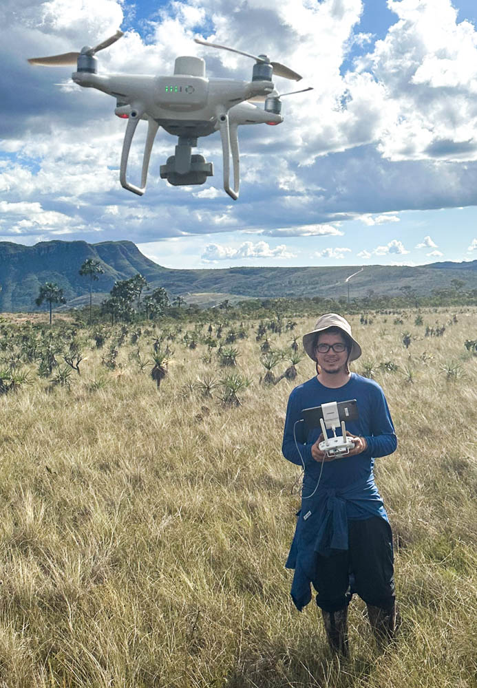

```{r setup, include=FALSE}
knitr::opts_chunk$set(echo = FALSE)
```





### About me

I am an ecologist and researcher inspired to understand the mechanisms underlying the functioning of our world. I have been exploring different research topics since the beginning of my career, ranging from modeling plants to fieldwork and mammal surveys. Most of my research has focused on understanding how populations, communities, and ecosystems respond to human disturbances from different perspectives. I am fascinated and motivated to comprehend Tropical ecosystem maintenance under disturbed scenarios such as those triggered by the Anthropocene epoch.


### Academic Background and Skills

I have a bachelor's in [*Ecology*](https://repositorio.unesp.br/handle/11449/155815), a period in which I started to earning about ecosystem synergy from climate change to ecosystem services. During this period, I was a member of the Earth System Science Laboratory, which focused on the political resources that climate change and human adaptation affected. Under this laboratory supervision, I carried out my thesis project, where I simulated the future risks of the high CO² concentration for maintaining the hydrological cycles in the Amazon Forest. Such cycles are extremely important to sustain the quality of ecosystem services this tropical forest provides, including those related to fauna, flora, and local populations, as well as to different bioregions of Brazil. For this work, I received a highly competitive scholarship from a Brazilian governmental research support institution, [FAPESP]( https://bv.fapesp.br/en/bolsas/162201/an-analysis-modeling-of-the-hydrological-cycle-and-impacts-of-increased-atmospheric-co2-concentratio/). This research also pleasured me to work directly at the beginning of the [Amazon-FACE](https://amazonface.inpa.gov.br/). Besides theoretical scientific learning, this experience allowed me to acquire skills related to data management and acquisition, GIS image processing, and programming language.

In between my BSc. in *Ecology* and my Master's graduation, I applied my experience and skills in different laboratories, allowing me to learn and improve my knowledge of other topics. Most of my work and contributions during this period relied on mapping and conducting mammal surveys in the Brazilian Atlantic Forest. Meanwhile, I improved my skills in data manipulation, statistics, and GIS using tools such as R, Python, QGIS, and ArcGIS. These experiences significantly opened my mind to their real-world application through parametric and non-parametric statistical analysis and mapping approaches by identifying risk areas, modeling species, and improving fieldwork decisions by decreasing time spent and financial costs. Furthermore, during this time, I established connections with collaborators and started publishing papers as a first author and co-author.

I performed a Master's in [*Ecology and Biodiversity*](https://repositorio.unesp.br/bitstream/handle/11449/204150/souza_ys_me_rcla.pdf?sequence=3&isAllowed=y) from 2019 to 2021. As part of my thesis, I worked on the [BIOTA]( https://souzayuri.shinyapps.io/biota/) project, a long-term experiment with ten years of field data collection. This project aimed to investigate the effects of mammal defaunation on plant communities in the Brazilian Atlantic Forest. At this stage in my ecological career, I already had experience working with climate change and water balance models using theoretical plant physiology and mammal assemblage. However, my knowledge lacked in understanding organisms' dynamics and diversity. For this purpose, I received a competitive fellowship from the [FAPESP](https://bv.fapesp.br/en/bolsas/186517/influence-of-defaunation-on-the-dynamics-of-tropical-plant-life-forms/) institution for the second time to investigate large mammalian herbivores' temporal role in modulating plant composition, diversity, and dominance.

After my master's I did an [*MBA in Data Science & Analytics*](https://moveurl.me/yUJbAe). Through this MBA, I created a project called [ReSeed](https://souzayuri.github.io/posts/2022-09-14-building-my-3rd-shinyapp/) to improve my data management, storage, and visualization skills. I want to use these tools to help people during decision-making regarding data lack of information and potential collaborations. My project was part of a [FAPESP technician fellowship](https://bv.fapesp.br/en/bolsas/197712/curatorship-processing-and-synthesis-of-seed-dispersal-traits-of-plants-and-animals-from-literature-/) I previously owned to work as a data curator of plant traits database under the supervision [Dr. Marina Corrêa Côrtes](https://marinaccortes.wixsite.com/marina). 

### Present

I am currently pursuing a Ph.D. in *Biology* at the [University of Miami](https://news.miami.edu/grad/stories/2022/10/congratulations-to-our-2022-2023-fellows.html). Under the supervision of [Dr. Amy Zanne](https://amyzanne.org/) I seek to understand the mechanisms involving transversal and vertical energy interchange in the below and above-ground process. For this purpose, I expect to utilize termites as a model to understand their role as soil engineers by stimulating nutrient enrichment. I also aim to investigate how their predation by consumers might result in trophic cascades, thus affecting the decomposition rate of organic matter in greenhouse gas emissions such as CO² and methane.  

