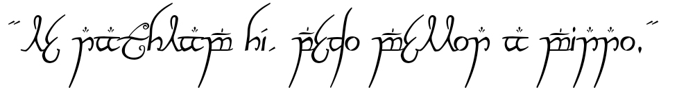

```{r setup, include=FALSE}
knitr::opts_chunk$set(echo=F, message=F, warning=F)
```

```{css echo=FALSE}

d-title h1 {
  font-size: 0px;
}

```


<div class="layout-chunk" data-layout="m-screen">
<div id="particles-js"></div>
</div>
<script src="./assets/particles.min.js"></script>
<script src="./assets/app.js"></script>

### 

I am an Ecologist fascinated by how the environment and its organisms relate to each other to keep the world as we know moving. Besides Ecology, I also spend a lot of time reading and searching about technology, computing, and Data Science. This last one was something that grew on me in the past years, so I am trying to connect its techniques and tools with Ecology studies. During my free time, I like hanging out with people to have beers and talk about books, tv series, games, and sci-fi. Fun (nerd) fact about me: I love the Middle Earth histories.



"*Le nathlam hí, pedo mellon a minno*"


---
# The code below will show the visitor count. If you want to have this in the webpage, then please go to _custom.html file in the repo where I have described the steps to get a visiter counter widget.
---

<center>Visitors<center>
<center>

<div id="sfcd944qbhwamjk6hurnyx8gplwunylbmtn"></div>
<script type="text/javascript" src="https://counter5.optistats.ovh/private/counter.js?c=d944qbhwamjk6hurnyx8gplwunylbmtn&down=async" async></script> 
<noscript><a href="https://www.freecounterstat.com" title="website counter code"></a></noscript>

</div><center>

<!-- adding share buttons on the right side of the page -->
<!-- AddToAny BEGIN -->
<div class="a2a_kit a2a_kit_size_32 a2a_floating_style a2a_vertical_style" style="right:0px; top:150px; data-a2a-url="https://souzayuri.github.io/" data-a2a-title="Yuri Souza">
<a class="a2a_button_twitter"></a>
</div>
<script>
var a2a_config = a2a_config || {};
a2a_config.onclick = 1;
</script>
<script async src="https://static.addtoany.com/menu/page.js"></script>
<!-- AddToAny END -->

